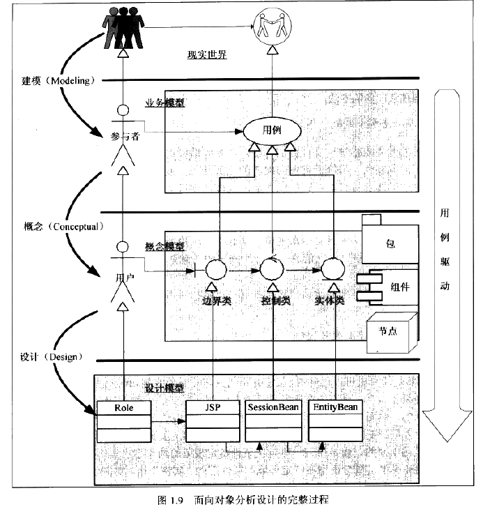

## 
## 1、 面向对象和面向过程
1.1.1、面向过程方法：
开始点--> 到终点， 前因后果，什么必须是确定的

1.1.2、 面向对象就是为了解决现实问题而出现的
不同对象之间没有关系，在一定情况下确定关系
抽象层次，在不同层次看到东西是不一样的
## 1.2、UML 带来了什么
### 1.2.1、什么是UML（Unified Modeling Language 统一建模语言）

### 1.2.2、统一语言
主要是统一

### 1.2.3、可视化

### 1.2.4、 从现实世界到业务模型
1655- 1700 p40
### 1.2.5、从业务模型到概念模型
1.  边界类：分界线
2. 实体类：与现实对应
### 1.2.5、 从概念模型到设计模型

## 1.3、统一过程简介
### 1.3.1、RUP是什么（Rational Unified Process)

> 工件： 工件也称为成果物或制品（Artifact) 这个可交付物（Deliverable)是有些差别的
RUP是工作方法，UML生成语言和文档
RUP是软件控制一整套方法论
