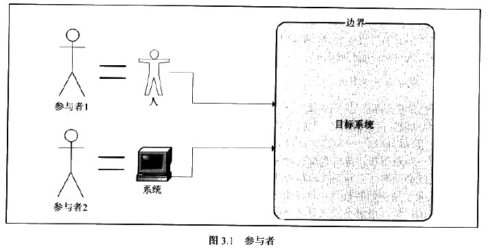
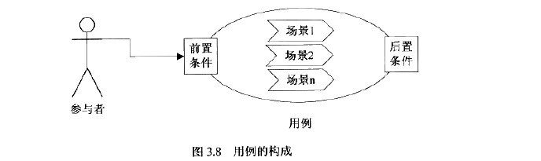
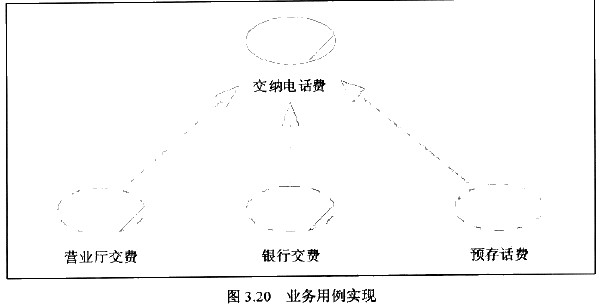
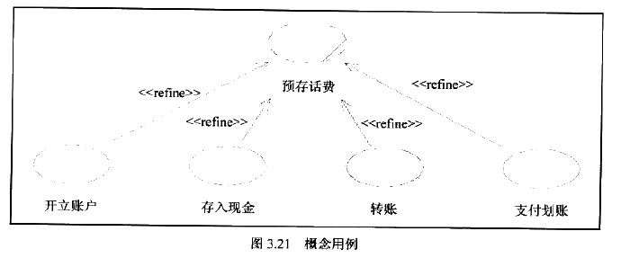
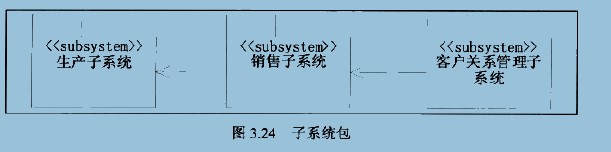
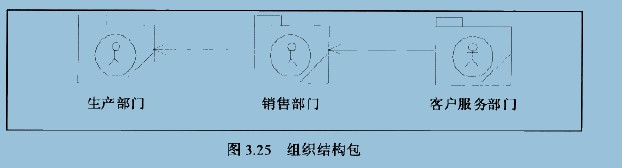
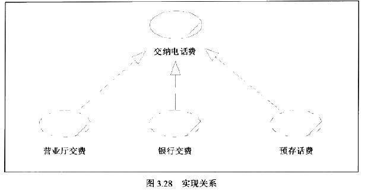
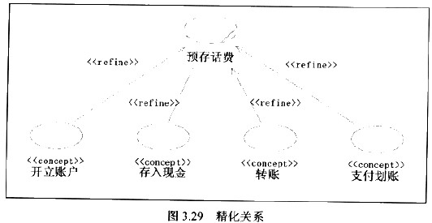

## 3.1、版型
2018年12月17日10:09:42

版型（stereotype）：就不同场景下，让同一个元素表达特定的含义，也就是扩展
## 3.2、参与者(主角)

### 3.2.1、基本概念
actor是在系统之外与系统交互的某人或某事物， 参与者必须涉及到边界

参与者特点
- 参与者位于边界之外
- 参与者可以非人 定时器（参与者） 跑任务

找出参与者  和 业务工人（business worker）
- 谁对系统有着明确的目标和要求并且主动发出动作？
- 系统是为谁服务的？
### 3.2.2、发现参与者
- 谁负责提供、使用或删除信息？
- 谁将使用此功能
- 谁对某个特定功能感兴趣？
- 在组织中的什么地方使用系统？
- 谁负责支持和维护系统？
- 系统有哪些外部资源？
- 其他还有哪些系统将需要与该系统进行交互？
### 3.2.3、业务主角

在初始需求阶段，请务必使用业务主角，时时牢记业务主角是客户实际业务里的参与者，没有计算机系统，没有
抽象的计算机角色。业务主角必须在实际业务里能找到对应的岗位或人员。
- 业务主角的名称是否是客户的业务术语？
- 业务主角的职责是否在客户的岗位手册里有对应的定义？
- 业务主角的业务用例是否都是客户的业务术语？
- 客户是否对业务主角能顺利理解？
### 3.2.4、业务工人（会涉及领域模型）

区别参与者（actor），业务工人是配角，参与者（主角）

区分业务工人的方法：（最直接方法是判断是否在边界之外还是边界内）
- 他是主动向系统发出动作吗？
- 他有完整的业务目标吗？
- 系统是为他服务的吗？
### 3.2.5、参与者与涉众的关系

涉众（stakeholder）,涉众是与建设的这个系统有利益相关的一切人和事

### 3.2.6、参与者与用户关系
用户（user）是指系统的使用者
### 3.2.7、参与者与角色的关系
角色是参与者的职责。角色是一个抽象的概念，从众多参与者的职责中抽象出相同的那一部分，将其命名而形成一个角色，
一个用户可以代理多个参与者，因此一个用户可以拥有多个职责，也就是可以被指定多个角色
### 3.2.8、参与的核心地位

### 3.2.9、检查点

## 3.3、用例
### 3.3.1、基本概念
一个完整的用例定义由参与者、前置条件、场景、后置条件构成

### 3.3.2、用例的特征
- 用例是相对独立的  （用例可以独立完成任务）
- 用例的执行结果对参与者来说是可观测的和有意义的
- 这件事必须由一个参与者发起。不存在没有参与者的用例，用例不应该自动启动，也不应该主动启动另一个用例
- 用例必然是以动宾短语形式出现的
- 一个用例就是一个需求单元，分析单元，设计单元、开发单元、测试单元、甚至部署单元。
### 3.3.3、用例的粒度
只是统一级别
### 3.3.4、用例的获取

主角确定
- 主角是位于系统边界外的
- 主角对系统有着明确的期望和明确的回报要求。
- 主角的期望和回报要求在系统边界之内

询问业务代码
- 您对系统有什么期望？
- 您打算在这个系统里做些什么事情？
- 您做这件事的目的是什么？
- 您做完这件事情希望有一个什么样的结果

### 3.3.5、用例和功能的误区

功能可以就是单个具体能力，用例是一个完整的过程
### 3.3.6、目标和步骤的误区
完整的目标
### 3.3.7、用例粒度的误区
统一粒度级别
### 3.3.8、业务用例

业务用例是系统用例一个重要输入。
### 3.3.9、业务用例实现

业务任务实现方式

### 3.3.10、概念用例

934-940  90
### 3.3.11、系统用例
如果说业务用例是客户业务视角的话，从现在开始，系统用例采用系统视角来看待了

### 3.3.12、用例实现

## 3.4、边界
根据需求边界不断变化的
### 3.4.1、边界决定视界

不同角度看问题
### 3.4.2、边界决定抽象层次

自顶向下不断抽象本层次边界
### 3.4.3、灵活使用边界
高手可以灵活利用边界完成设计工作

## 3.5、业务实体
业务实体是类（class）的一种版型， 包括属性和方法
### 3.5.1、业务实体的属性

取出业务相关的属性
### 3.5.2、业务实体的方法
抽象视角不同，抽象的方法就不同。
### 3.5.3、获取业务实体
分清业务属性和业务实体
## 3.6、包
Use Case View、Logic View和Component View

包最重要的用途就是分类元素。

- 领域包（Domain Package）: 领域宝用于分类业务领域内的业务单位，每个包代表业务的一个领域。

- 子系统 （SubSystem) ：用于分类系统内部逻辑对象并形成子系统

- 组织结构（Organization unit） 组织结构包用于分类业务领域中的组织结构，它可以直接用来表述企业的组织结构

- 层（LAyer）： 用于分类软件中的层次，层可以用来展示软件的架构信息

## 3.7、分析类
性质
- 分析类代表系统中主要的职责簇
- 分析类可以产生系统的设计类和子系统

分类： 边界类（boundary）, 控制类（control）、和实体类（entity）
### 3.7.1、边界类
定义: 是一种用于对系统外部环境与其内部运作之间的交互进行建模的类
- 参与者与用例之间应当建立边界类
- 用例与用例之间交互，应该为其建立边界类
- 如果用例与系统边界之外的非人对象有交互，例如第三方系统，应当为其建立边界类
- 在相关联的业务对象有明显的独立性要求，即他们可能在各自的领域内发展与变化，但又希望互不影响时，应该为他们建立边界类

一个好的边界类应该具有以下特点
- 边界类应该有助于提供系统的可用性
- 边界类应该尽可能地保持在较高层次（如概念层次）上
- 边界类应该合理封装介于系统与主角之间的交互
- 如果主角改变他们为系统提供输入的方式，边界类就应该是唯一需要改变的对象
- 如果系统改变为主角提供输出的方式，边界应该是唯一需要改变的对象
- 边界类必须知道其他对象类型的需求，以便它们能够得意实施，并相对于“系统内部元素”保持其可用性和有效性

### 3.7.2、控制类
用于对一个或几个用例所特有的控制行为进行建模。

### 3.7.3、实体类
实体类是用于必须存储的信息和相关行为建模的类

### 3.7.4、分析类的三高

- 高于设计实现 ：不需要顾忌实现问题，专心解决需要问题
- 高于语言实现
- 高于实现方式
## 3.8、设计类
设计类是系统实施中一个或多个对象的抽象。

### 3.8.1、类

### 3.8.2、属性
对象特征性、属性同时表明了对象的唯一性。属性名称是一个名词、描述与对象有关的属性和角色
### 3.8.3、方法
原则上，访问对象或影响其他对象的属性或关系的唯一途径就是方法，直接访问和修改对象的属性是不提倡的。
### 3.8.4、可见性
- 公有：除了类本身以外，属性和方法对其他模型元素的是可视性
- 保护： 属性和方法只对类本身、它的子类或友元（取决于具体语言实现）是可视性
- 私有： 属性和方法只对类本身和友元可视性
- 实施： 属性和方法只在类本身的内部是可视性

## 3.9、关系

### 3.9.1、关联关系（association）
关联关系是用一条直线表示的
### 3.9.2、依赖关系（dependency）
依赖关系是用一条带箭头的虚线表示的， A -----》B（A依赖于B）
A对象保存了B对象ID，但A对象对B对象没有操作，这个A仅仅是“知道”B对象，应当关联关系，如果A对象
使用了B对象的属性或方法，则B的修改会导致A的修改，这时A依赖于B。

### 3.9.3、扩展关系（extends）可选
扩展关系是用一条带箭头的虚线加版型<<extends>>来表示的。
### 3.9.4、包含关系（include）
包含关系是用一条带箭头的虚线加版型<<include>>来表示的

### 3.9.5、实现关系（realize）
实现关系是用一条带空心箭头的虚线表示的 A ----▷ B (A 实现 B)。他特别用于用例模型汇总连接用例和用例实现，说明基本用例的一个实现方式。
基本用例与用例实现之间构建了实现关系

### 3.9.6、精化关系（refine）
精化关系是用一条带箭头的虚线加版型<<refine>>表示的

### 3.9.7、泛化关系（generalization）
泛化关系是用一条带空心箭头的直线表示的， A ————▷B（A继承自B）
### 3.9.8、聚合关系（aggregation）
聚合关系是用一个条带有空心菱形箭头的直线表示的， A——————◇B（A聚到B上或， 说B由A组成）
### 3.9.10、组合关系（Composition）
组合关系是用一条带有实心菱形箭头的直线表示的 A————————◆B（A组合成B， 或者说B由A构成），组合关系是一种强依赖的特殊聚合关系
## 3.10、组件
组件是系统中实际存在的可更换的部分， 他实现特定的功能，符号一套接口标准并实现一组接口。组件代表系统中的一部分物理实施，包括软件代码（源代码、二进制代码或者可执行代码）或其等价物
组件的特性
### 3.10.1、完备性
一个组件应当能够完成一项或一组特定的业务目标（功能）
### 3.10.2、独立性
组件应当可以独立部署的，与其他组件无依赖关系，最多仅仅保持关联关系。
### 3.10.3、逻辑性
组件是从软件构件设计的观点来定义的，并非从需求中可以直接导出。
### 3.10.4、透明性
组件的修改应当只涉及到组件的定义以及组件所包含的类的重新指定。而不应当导致类的修改。
### 3.10.5、使用组件
组件是从系统结构的角度来划分分析设计的结果的。
    - 分布式应用
    - 应用集成  遗留系统问题
    - 第三方系统  为第三方设计一组接口形成组件
    - SOA服务（Service Oriented Architecture）
## 3.11、节点
节点是带有至少一个处理器，内存以及可能还带有其他设备的处理元素
节点是应用程序的部署单元。
以下两种情况需要使用节点元素
### 3.11.1、分布式应用环境
### 3.11.2、多设备应用环境

