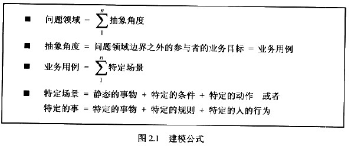
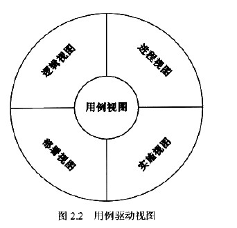
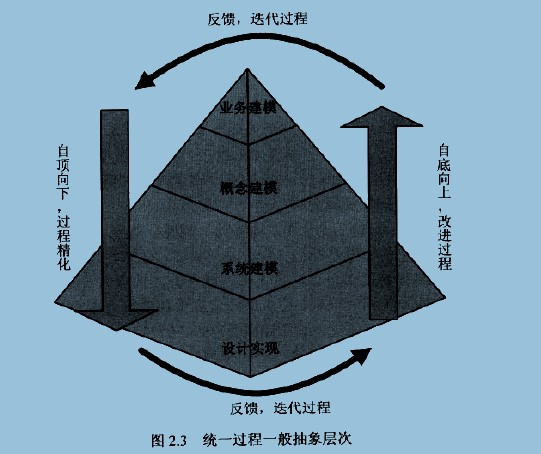

>建模概念学习
## 2.1、建模
不同抽象角度认识抽象描述不同

人：业务主角（Business Actor）、业务工人（Business Worker）, 参与者（actor)
事：业务用例（Business Use Case)、 系统用例（Use Case）,
物：业务实体（BusinessEntity） 实体（Entity
规则：

## 2.2、用例驱动

- 逻辑视图 :说明关键的用例实现和子系统、包和类。
- 进程视图：系统中进程的详细组织结构，其中包含类和子系统到进程和线程的映射
- 部署视图：处理活动在系统中各个节点的分布，包括进行和线程的物理分布。
- 实施视图：获取为实施制定的构造决策
## 2.3、抽象层次

## 2.4、视图
视图和视角是两个被忽略的关键概念

## 2.5、对象分析方法
- 一切皆对象
- 对象都是独立的
- 对象具有原子性（附上边界）
- 对象都是可以抽象的
- 对象都是有层次性