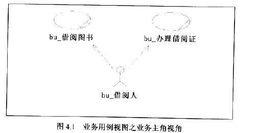
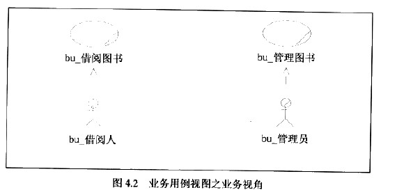
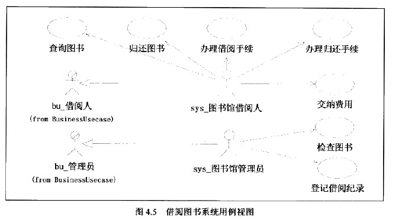

> 元素是UML的基本词汇， 那么视图就是语法，UML通过视图将基本元素组织在一起，形成一个有意义的句子
> 结构性特征是用静态视图来表达的， 行为性特征是用动态视图来表达的。
## 4.1、 静态视图
静态视图就是表示静态事物的，它只描述事物的静态的结构，而不是描述动态的行为，静态视图包括用例图、类图和包图
### 4.1.1、用例图
定义：用例图采用参与者和用例作为基本元素，以不同的视角展现系统的功能性需求
#### 4.1.1.1、业务用例视图
业务用例视图使用业务主角和业务用例展示业务建模的结果。
- 业务主角视角

- 业务模块视角 ： 展示业务领域的业务目标

业务用例视图展示了业务系统的功能性需求。
#### 4.1.1.2、业务用例实现视图
业务用例是业务需求，而业务用例实现则是业务的实现路径

#### 4.1.1.3、概念用例视图（不是必须的）
对于业务用例进一步扩展、包含和精化

#### 4.1.1.4、系统用例视图

#### 4.1.1.5、系统用例实现视图

### 4.1.2、类图
类图用于展示系统中的类以及相互之间的关系
 三个层次是概念层、说明层、实现层。
#### 4.1.2.1、概念层类图
在概念层上，类图着重于对于问题领域的概念化的理解。而不是实现，因此类名称通常都是问题领域中实际事物的名称、
概念层的类图是独立于实现语言和实现方式的。

#### 4.1.2.2、说明层类图
考虑是类的接口而不是实现，主要实现概念的目标需要哪些接口可以实现

#### 4.1.2.3、实现层类图
类是实现代码的描述，类图中的类直接映射到可执行代码。
这个阶段，类图可视为伪代码。甚至可以用来工具直接将实现层类图生成可以执行代码，MDA建模工具就是通过模型来生成代码的。Rose也是可以

### 4.1.3、包图
一般都用来展示高层次的观点。

## 4.2、动态视图
动态视图是描述事物动态行为，需要注意的是，动态视图不能够独立存在，他必须特指一个静态视图或UML元素，说明在静态视图规定的事物结构下他的动态行为
动态视图： 活动图、状态图、时序图和协作图
### 4.2.1、活动图
活动图描述为了完成某一目标需要做的活动以及这些活动的执行顺序。UML中有两个层面的活动图、一种用于描述用例场景、另一种用于描述对象的交互
#### 4.2.1.1、用例活动图 （业务流程）

- 起始点 标记流程开始、一个活动图，或者说一个业务流程有且仅有一个起始点
- 活动
    - entry 入口动作
    - do 执行的动作
    - event 事件、执行动作
    - exit 退出动作
- 判断
判断根据某个条件进行决策、执行不同的流程分支
- 同步
同步分为同步起始和同步汇合，同步起始表示从他开始的多个支流并行执行： 同步汇合表示多个支流同时到达在执行后续活动
- 结束点
结束点表示业务流程的终止。
- 基本流
基本流表示最主要的、最频繁使用的默认的业务流程分支。
- 支流
支流表示不经常使用的，由某个条件出发的、非默认的业务流程分支。
- 异常流
异常流表示非正常的，不是业务目标期待的、容错性、处理意外情况的业务流程分支。
- 组合活动
#### 4.2.1.2、对象活动图（交互）
对象活动图展示对象的交互。

#### 4.2.1.3、泳道
泳道代表了一个特定的类、人、部门、层次等对象的职责区、这些对象在业务流程中复制执行的活动集合构成了它们的职责。

#### 4.2.1.4、业务场景建模
- 帮助发现业务用例
- 帮助检查业务用例粒度
- 帮助检查业务主角
- 帮助检查业务用例
#### 4.2.1.5、用例场景建模
- 帮助发现概念用例
- 帮助发现角色
- 帮助发现业务实体
- 帮助建立领域模型

### 4.2.2、状态图
状态机主要用于描述对象的状态的变化已确定何种行为改变了对象的状态、以及对象状态变化对系统的影响。
状态图通常只是描述单个对象的行为，如果要描述对象间的交互，最好采用时序图或协作图

- 初始状态
初始状态是状态机的起始位置， 他不需要事件的触发。
- 状态
- 复合状态
- 转移
- 事件
- 条件
- 最终状态
### 4.2.3、时序图
用来描述按时间顺序排序的对象之间的交互模式
类有三个层次的观点： 概念层、说明层和实现层、他们分别对应于业务建模阶段、概念建模阶段和设计建模阶段。 相应的，也可以在这个三个层次上
分别对业务实体对象、分析类对象和设计类对象绘制时序图。
#### 4.2.3.1、业务模型时序图
业务模型时序图用于为领用模型中的业务实体交互模型、其目标是实现业务用例。

- 对象
表示参与交互的对象，每个对象都带有一条生命周期线，对象被激活（创建或被引用）时，生命周期线上会出现一个长条（会话），表示对象的存在
- 生命周期线
- 消息 有一个对象的生命周期线指向另一个对象的生命周期线。如果消息指向到空白的的生命周期线，将会创建一个新的会话
- ——————> 为简单消息
- <------ 为返回消息
- ———×———> 为同步消息 ：表示发出消息的对象将停止所有后续动作一直等到接收到消息方法响应。同步消息将阻塞元消息对象的所有行为
- ————○———> 为限时消息， 限时消息是同步消息的一种特殊情况。源消息对象发出消息后将等待响应一段时间，在限定时间内还没有响应时，源消息对象将会取消阻塞状态而执行后续操作。
-  异步消息 表示源消息对象发出消息后需要等待响应，而可以继续执行其他操作。
- 会话  表示一次会话， 在会话过程中所有对象共享一个上下文环境。
- 销毁 绘制在生命周期线上。表示对象的生命周期终止的了。
绘制业务模型时序图注意：
- 时序图以达到业务目标为准则
- 使用描述语言应当采用业务术语。
- 时序表达的内容会对将来的分析设计带来帮助。
#### 4.2.3.2、概念模型时序图
目标同样是实现业务用例，由于分析类本身代表了系统原型。所以这个阶段的时序图已经带有计算机理解。

#### 4.2.3.3、设计模型时序图
设计模型时序图使用设计类作为对象绘制。 目标是实现概念模型中的某个事件的流，一般以一个完整交互为单位，消息细致到方法级别

### 4.2.4、协作图

描述了对象间交互的一种模式。
协作图的建模结果用于获取对象的职责和接口，与时序图不同是协作图因为展示了对象间的关系、使得他更适合获取对象结构的理解、而时序图则更适合获取对象调用过程的理解。

#### 4.2.4.1、业务模型协作图

- 对象： 表示参与协作的对象。
- 对象关联： 连接两个对象，表示两者的关联。
- 消息 协作图中的消息与时序图中的消息定义完成一样。
- 消息序号：执行步骤
#### 4.2.4.2、概念模型协作图
带有计算机术语

#### 4.2.4.3、设计模型协作图

