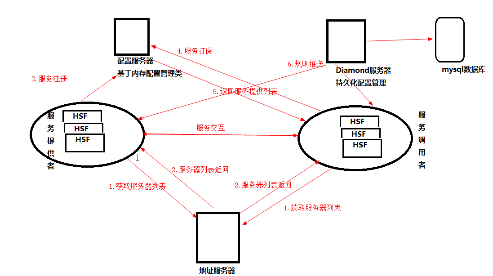

## 3.1、淘宝平台服务化的历程
出现问题
1. 项目团队间协作成本高、业务响应越来越慢。
2. 应用复杂度超过人的认知负载
3. 错误难以隔离
4. 数据库连接能力很难扩展。
5. 应用扩展成本高。

采用SOA服务改造之后
1. 降低不同模块开发团队间的协同成本，业务响应更加迅捷
2. 大大降低系统间的耦合度以及整体复杂度，各个开发团队可专注各种业务模块。
3. 避免了个别模块的错误给整体带来的影响
4. 业务拆分后解放了对单个数据库集群连接数的能力依赖
5. 做到针对的业务能力扩容，减少不必要的资源浪费
## 3.2、中心化和去中心化服务框架对比
SOA的特性
- 面向服务的分布式计算
- 服务间的松耦合
- 支持服务的组装
- 服务注册和自动发现
- 以服务契约方式定义服务交互方式
### 3.2.1、中心化和去中心的业务诉求
1. ESB模式的中心化服务架构的根本诉求

实现不同系统之间的互通，而ESB是最简单（实现中转功能的途径），最快速的

2. 去中心分布式服务架构解决的问题

由于其互联网特性，用户量不断增加，考虑到扩展性，中心化带来平台能力难以扩展问题，以及潜在的雪崩影响
### 3.2.2、平台功能比较
1. 服务调用方式的不同带来业务的响应和扩展成本
    - 中心化： 服务调用者-> ESB（接收服务请求）->服务提供者（服务处理） -> ESB(服务提供返回结果)-> 服务调用者（服务返回）
    （有四次网络会话创建和数据传输）
    - 去中心：一次服务调用只有两次网络会话创建和数据传输
2. 雪崩效应束缚了中心化服务框架的扩展能力
    - 中心化: ESB成为一个性能瓶颈
## 3.3、阿里巴巴分布式框架HSF（High Speed Framework）
### 3.3.1、HSF服务框架主要组件
1. 服务提供者：war形式运行在tomcat中
2. 服务调用者： war形式运行Tomcat，也支持 C/C++, PHP 、Node.js
3. 地址服务器：给服务提供者和服务调用者提供配置服务器（理解为服务发现注册中心）和 Diamond服务器(规则配置，比如说限流)列表信息
4. 配置服务器：服务发布和订阅信息保存在内存中， 配置服务器与所有服务提供者和服务调用者采用是长连接，采用心跳检测
5. Diamond服务器： 一个统一配置管理服务器，给应用提供统一的配置设置和推送服务
    - 安全掌控规则、服务路由权重、服务QPS阈值规则配置，持久化到MySQL数据库中

    - 使用场景
     - 设置 白名单（服务调用者所在服务节点IP地址）的方式设置某些服务或服务中的方法只能让特定IP地址的服务调用
     - 通过用户认证的方式控制服务是否能够调用
     - 按照不同权重的设置不同服务器调用者对多个服务提供者服务节点的访问
     - 设置某些服务QPS的能力上限值，一旦该服务的QPS达到阈值拒绝服务的继续调用，秒杀和促销

- 服务节点对配置服务器列表的获取
- 服务的注册发布
- 服务的订阅
- 服务规则推送
- 服务交互

### 3.3.2、介绍HSF框架如何给服务提供以上能力
1. HSF框架采用Netty+Hession数据序列化协议实现服务交互
> 多路复用的TCP长连接方式，即一个连接交替传输不同请求的字节块，TCP顺序传输中的线头阻塞问题（队列的首个packet由于它的目的端口正忙而被延迟转发，导致后面的packets被blocked）
，Hessian是在性能和稳定性同时考虑下最优的序列化协议。
2. HSF框架的容错机制 ： 自动找到下一个可用的服务提供者，当然配置服务器也会去监控服务提供者，及时提供给消费者
3. HSF框架的线性扩展支持： 可以进行水平扩展
## 3.4、关于微服务
### 3.4.1、微服务的典型特征的描述：
- 分布式服务组成的系统
- 按照业务而不是技术来划分组织
- 做有生命的产品而不是项目
- 智能化服务端点与傻瓜式服务编排
- 自动化运维
- 系统容错
- 服务快速演化

### 3.4.2、微服务问题
- 微服务的应用架构和如何有效进行有效的服务管控。
- 分布式事务难题
- 自动化运维和平台稳定性
- 微服务的服务设计
- 原有组织架构是否满足微服务架构持续发展的需要。