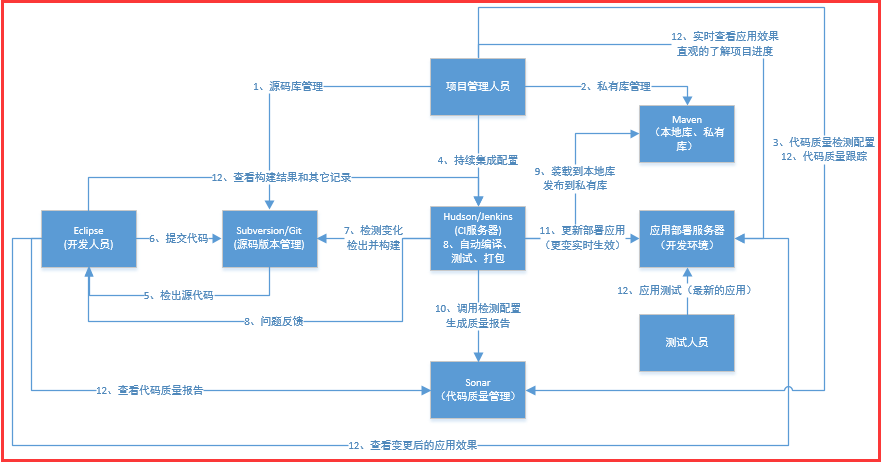

## 1、 持续集成介绍

- 持续集成是一种软件开发实践
    团队开发成员经常集成他们的工作，每次集成都通过自动化的构建
    （包括自动化编译，测试、发布）来验证，从而尽快地发现集成错误
- 持续集成的价值、要素、原则。。。

- 持续集成的好处的理解
    - 管理大规模的工程的必须性
    - 解放应用更新部署的生产力
    - 能够让团队成员间进行高效的协作开发
    - 能够与各种项目管理工具一起整合成一套实用而且灵活项目开发管理平台
    - 实时交付可用、可测试的软件产品

## 2、持续集成管理平台的组成

    - 持续集成管理平台不只是CI服务器， 是一系列软件开发管理工具的组合
    - 源码版本管理： Subversion Git
    - 项目构建工具： Maven， Ant
    - 代码质量管理： Sonar（Checkstyle, PMD, FindBugs....）
    - 持续集成引擎： Hudson、Jenkins、 Apache Continuum
    - 应用持续部署： 操作系统、JDK Tomcat， JBoss。。。

    - 实施持续集成过程中用到的其他各种工具，各种插件。。。

 

## 3、 持续集成实践介绍
    - 持续管理平台

    Hudson + Maven + Sonar + Subversion

## 4、 持续集成篇的课程内容

- (1)、Subversion 源码版本控制系统的安装

Subversion + Apache + jsvnadmin

- (2)、Maven 私有库和本地库的安装与配置

Sonatype Nexus + Maven
- (3) Sonar代码质量管控平台的安装与使用配置

-（4）Hudson持续集成引擎的安装与配置