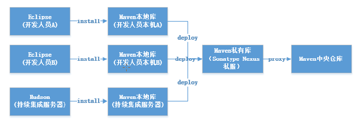
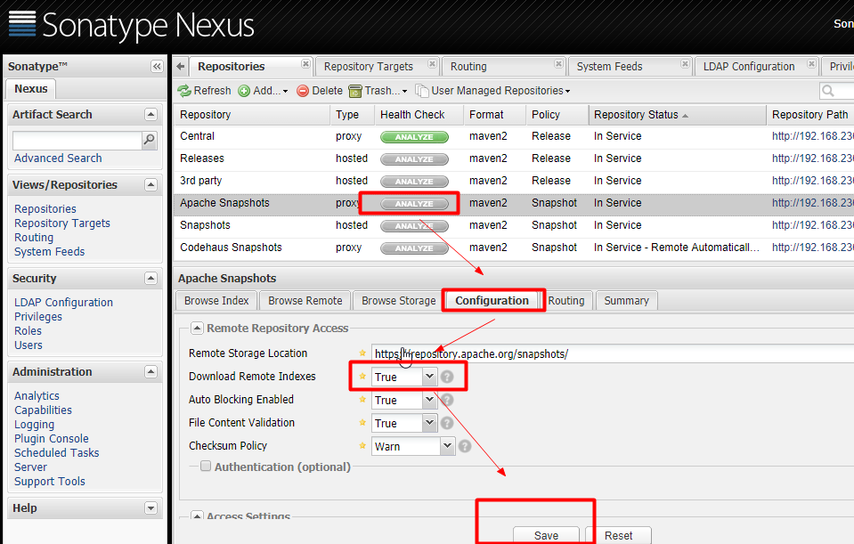

## 1、示意图


如果构建的Maven项目本地仓库没有对应的依赖包，那么就会去Nexus私服下载，那么如果Nexus私服也没有此依赖包，就会去远程中央仓库下载依赖，
Nexus私服下载成功后再下载至本地Maven库供项目引用

## 2、安装Nexus私服
````
1、下载
# wget https://sonatype-download.global.ssl.fastly.net/nexus/oss/nexus-2.11.2-03-bundle.tar.gz

2、解压
# mkdir nexus
# tar -zxvf nexus-2.11.2-03-bundle.tar.gz -C nexus
# cd nexus
# ls
nexus-2.11.2-03 sonatype-work
(一个nexus服务， 一个私有库目录)

3、编辑Nexus的nexus.properties文件，配置端口和work目录信息（保留默认）
# cd nexus-2.11.2-03
# ls
查看目录结构，jetty运行
# cd conf
# vi nexus.properties

4、编辑nexus脚本、配置RUN_AS_USER参数
# vi /root/nexus/nexus-2.11.2-03/bin/nexus
#RUN_AS_USER=
改为：
RUN_AS_USER=root

5、防火墙中打开8081端口
# vi /etc/sysconfig/iptables
添加

-A INPUT -m state --state NEW -m tcp -p tcp --dport 8081 -j ACCEPT
保存后重启防火墙
# service iptables restart

6、启动nexus
# /root/nexus/nexus-2.11.2-03/bin/nexus start

7、浏览器中打开： http://服务Ip:8081/nexus/

8、登录，默认用户admin 默认密码 admin123

````
## 3、Nexus配置
- 1、菜单Administration/Server配置邮箱服务地址(如果忘记密码，可以通过该邮箱找回密码)
- 给用户配置邮箱地址，方便忘记密码时找回：

- 2、仓库类型
    - group 仓库组： Nexus通过仓库组的概念统一管理多个仓库，这样我们在项目中直接请求仓库组既可请求到仓库组管理的多个仓库
    - hosted 宿主仓库： 主要用于发布内置项目构建或第三方的项目构件（如购买商业的构件）
    - proxy 代理仓库： 代理公共的远程仓库
    - virtual 虚拟仓库： 用于适配Maven 1；

   一般用到的仓库类型是hosted、proxy

   Hosted 仓库常用类型说明：
    - releases 内部的模块中release模块的发布仓库
    - snapshots 内部的SNAPSHOT模块的仓库
    - 3rd party 第三方依赖的仓库，这个数据通常是由内部人员自行下载之后发布上去的。

    3、 设置Proxy代理仓库（Apache Snapshots/Central/Codehaus Snapshots）

    
## 4、本地settings.xml配置
文件名：settings_edu
````xml
<?xml version="1.0" encoding="UTF-8"?>

<settings xmlns="http://maven.apache.org/SETTINGS/1.0.0"
          xmlns:xsi="http://www.w3.org/2001/XMLSchema-instance"
          xsi:schemaLocation="http://maven.apache.org/SETTINGS/1.0.0 http://maven.apache.org/xsd/settings-1.0.0.xsd">
	<localRepository>D:/.m2/repository</localRepository>
	<interactiveMode>true</interactiveMode>
    <offline>false</offline>
    <pluginGroups>
        <pluginGroup>org.mortbay.jetty</pluginGroup>
        <pluginGroup>org.jenkins-ci.tools</pluginGroup>
    </pluginGroups>

	<!--配置权限,使用默认用户-->
	<servers>
		<server>
			<id>nexus-releases</id>
			<username>deployment</username>
			<password>deployment123</password>
		</server>
		<server>
			<id>nexus-snapshots</id>
			<username>deployment</username>
			<password>deployment123</password>
		</server>
	</servers>

    <mirrors>

    </mirrors>

	<profiles>
		<profile>
		   <id>edu</id>
			    <activation>
                    <activeByDefault>false</activeByDefault>
                    <jdk>1.8</jdk>
                </activation>
			    <repositories>
					<!-- 私有库地址-->
				    <repository>
						<id>nexus</id>
						<url>http://192.168.230.131:8081/nexus/content/groups/public/</url>
						<releases>
							<enabled>true</enabled>
						</releases>
						<snapshots>
							<enabled>true</enabled>
						</snapshots>
					</repository>
				</repositories>
				<pluginRepositories>
					<!--插件库地址-->
					<pluginRepository>
						<id>nexus</id>
						<url>http://192.168.230.131:8081/nexus/content/groups/public/</url>
						<releases>
							<enabled>true</enabled>
						</releases>
						<snapshots>
							<enabled>true</enabled>
					   </snapshots>
					</pluginRepository>
				</pluginRepositories>
			</profile>
	</profiles>

	<!--激活profile-->
	<activeProfiles>
		<activeProfile>edu</activeProfile>
	</activeProfiles>

</settings>
````

## 5、项目的pom.xml配置 (edu-common-parent.xml)
ip地址修改
````xml
<distributionManagement>
        <repository>
            <id>nexus-releases</id>
            <name>Nexus Release Repository</name>
            <url>http://192.168.230.131:8081/nexus/content/repositories/releases/</url>
        </repository>
        <snapshotRepository>
            <id>nexus-snapshots</id>
            <name>Nexus Snapshot Repository</name>
            <url>http://192.168.230.131:8081/nexus/content/repositories/snapshots/</url>
        </snapshotRepository>
    </distributionManagement>
````