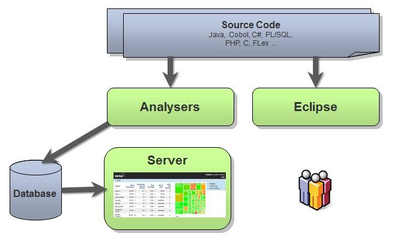

## 1、SonarQube的介绍

### 1.1、SonarQube是一个管理代码质量的开发平台

可以从七个维度检测代码质量（为什么要用SonarQube）：
1. 复杂度分布（complexity）: 代码复杂度过高将难以理解、难以维护
2. 重复代码（duplications）: 程序中包含大量复制粘贴的代码是质量低下的表现
3. 单元测试（unit tests）: 统计并展示单元测试覆盖率
4. 编码规范（coding rules）： 通过Findbugs，PMD、CheckStyle等规范代码编写
5. 注释（comments）： 少了可读性差，多了看起来费劲
6. 潜在的Bug（potential bugs） ： 通过Findbugs， PMD，CheckStyle 等检测潜在的bug
7. 结构和设计（architecture & design） ： 依赖、耦合等

Sonar可以集成不同的测试工具，代码分析工具、持续集成工具、IDE

Sonar通过对代码质量分析结果数据进行再加工处理，通过量化的方式来度量代码的质量的变化，从而可以方便地对工程代码质量管理

支持的语言包括：Java、PHP、C# C、Cobol、PL/SQL,Flex等。

### 1.2、SonarQube平台的组成：
1. 数组库： 存放SonarQube的配置数据，代码质量的快照数据
2. Web服务： 用于查看SonarQube的配置数据、代码质量的快照数据
3. 分析器： 对项目代码进行分析，生成质量结果数据并存入数据库汇中



## 2、安装SonarQube

### 2.1、安装MySQL （参考第12章）

### 2、配置MySQL
结合SonarQube， MySQL数据库最好使用InnoDB引擎，可提高性能
````
mysql> show engines;
看你的mysql当前默认的存储引擎
mysql> show variables like '%storage_engine%';

修改MYSQL存储引擎为InnoDB，在配置文件/etc/my.cnf中的
[mysqld] 下面加入 default-storage-engine=INNODB
# vim /etc/my.cnf
[mysqld]
default-storage-engine=INNODB

重启 mysql 服务器
# service mysqld restart

再次登录MySQL查看默认引擎设置是否生效
mysql> show variables like '%storage_engine%';

innodb_buffer_pool_size 参数值设置得尽可能大一点
这个参数主要作用是缓存 innodb表的索引，数据， 插入数据时的缓冲
默认值： 128M，专用mysql服务器设置的大小， 操作系统内存的70%-80%最佳。
设置方法： my.cnf文件[mysqld] 下面加入 innodb_buffer_pool_size参数
# vi /etc/my.cnf
[mysqld]
innodb_buffer_pool_size=256M

设置MySQL的查询缓存query_cache_size 最小设置15M
# vi /etc/my.cnf
[mysqld]
query_cache_type=1
query_cache_size=32M

重启mysql服务器
# service mysqld restart
验证缓存设置是否生效
mysql> show variables like '%query_cache%';

3、 创建sonarqube数据库（UTF-8编码）
````

## 安装SonarQube的WebServer
[下载地址](http://www.sonarqube.org/downloads)
````
下载：
# wget http://dist.sonar.codehaus.org/sonarqube-4.5.4.zip
解压安装：
# unzip sonarqube-4.5.4.zip
# mv sonarqube-4.5.4 sonarqube

编辑sonar配置
# cd sonarqube/conf/
# vi sonar.properties
sonar.jdbc.username=root
sonar.jdbc.password=root

sonar.jdbc.url=jdbc:mysql://localhost:3306/sonarqube?useUnicode=true&characterEncoding=utf8&rewriteBatchedStatements=true&useConfigs=maxPerformance


sonar.web.host=0.0.0.0
sonar.web.context=/sonarqube
sonar.web.port=9090

防火墙中打开9090端口：
# vim /etc/sysconfig/iptables
-A INPUT -m state --state NEW -m tcp -p tcp --dport 9090 -j ACCEPT

重启防火墙， 是的端口配置生效
# service iptables restart

启动 SonarQube Web Server
# /root/sonarqube/bin/linux-x86-64/sonar.sh start

浏览器中输入：
http://192.168.230.131:9090/sonarqube/

登录，默认用户/密码为 admin/admin

````


