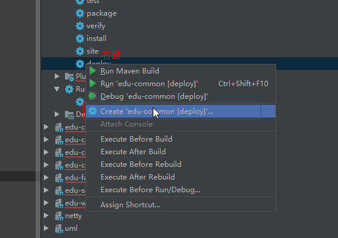

## 1、SonarQube配置
- 安装中文汉化包，发现版本不兼容，CheckStyle、PMD等插件
- 重启 sonarqube
- 输入网页登录： http://192.168.230.131:9090/sonarqube/

## 2、Maven配置
- 需要配置setting_edu.xml 增加一个profile
````xml
<profile>
				<id>sonar</id>
				<activation>
					<activeByDefault>true</activeByDefault>
				</activation>
				<properties>
					<!-- Example for MySQL-->
					<sonar.jdbc.url>
						jdbc:mysql://192.168.230.131:3306/sonarqube?useUnicode=true&amp;characterEncoding=utf8
					</sonar.jdbc.url>
					<sonar.jdbc.username>root</sonar.jdbc.username>
					<sonar.jdbc.password>root</sonar.jdbc.password>

					<!-- Optional URL to server. Default value is http://localhost:9000 -->
					<sonar.host.url>
						http://192.168.230.131:9090/sonarqube
					</sonar.host.url>
			</properties>
		</profile>
````
## 3、配置edu-common-parent的pom.xml文件 的<plugins>
````xml
             <plugin>  <!--设置sonar版本为3.2， 最新版本不兼容-->
                <groupId>org.sonarsource.scanner.maven</groupId>
                <artifactId>sonar-maven-plugin</artifactId>
                <version>3.2</version>
             </plugin>
````

## 4、配置运行



输入：clean install sonar:sonar -X -f pom.xml


双击运行


然后你将会在sonarqube 的web网页看到你工程