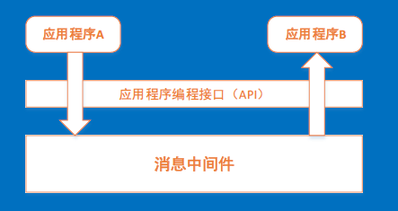
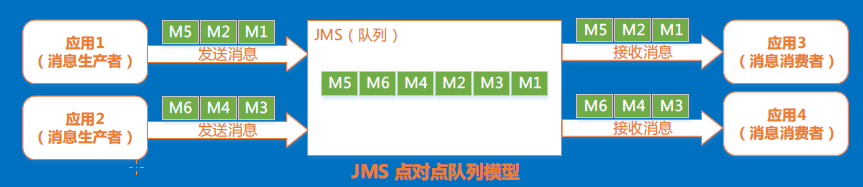
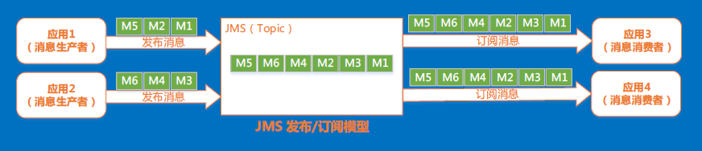

## 1、消息中间件的定义
Message-oriented middleware(MOM)is software infrastructure focused on sending and receiving
messages between distributed systems.

消息中间件是在分布式系统中完成消息的发送和接收的基础软件。
## 2、消息中间件的作用
消息中间可利用高效可靠的消息传递机制进行平台无关的数据交流， 并基于数据通信来进行分布式系统的集成，通过提供消息传递和
消息排队模型，可以在分布式环境下扩展进程间的通信。

通过消息中间件，应用程序或组件之间可以进行可靠的异步通讯，从而降低系统之间的耦合度，提高系统的可扩展性和可用性

## 3、应用场景
通过使用消息中间件对Dubbo服务间的调用进行解耦， 将同步变成异步
## 4、JMS（Java Message Service ）
JMS是javaEE中的一个关于消息的规范，是一套与具体平台无关的API。
- JMS元素
    - JMS提供者--- 连接面向消息中间件的，JMS接口的一个实现
    - JMS客户---- 生产的或消费消息的基于JAVA的应用程序或对象。
    - JMS生产者 --- 创建并发送消息的JMS客户
    - JMS消费者---- 接收消息的JMS客户
    - JMS消息 --- 可以在JMS客户之间的传递的数据的对象
    - JMS队列 --- 一个容纳那些被发送的等待阅读的消息的区域
    - JMS主题 --- 一个支持发送消息给多个订阅者的机制。

- JMS应用程序接口
    - ConnectionFactory(连接工厂) --- 用户用来创建到JMS提供者的连接的被管对象。
    - Connection(连接) --- 连接代表了应用程序和消息服务之间的通信链路
    - Destination(目标)--- 消息发布和接收地点，或者队列，或者主题。
    - MessageProducer(消息生产者) ---- 由会话创建的对象。 用于发送消息到目标
    - MessageConsumer(消息消费者) ---- 是在消息者和生产者之间传递的对象。
    - Session(会话) ------表示一个单线程的上下文， 用于发送和接收的消息。

## 5、JMS消息模型
1. 点对点或队列模型

- JMS 点对点对列模型特点：
    1. 消息生产者生产的消息到queue中，然后消息消费者从queue中取出并且消费消息。
    2. 消息被消费以后，queue中不在有存储，所以消息者不可能消费到已经被消费的消息
    3. Queue支持存在多个消费者，但是对一个消息而言，只会有一个消费者可以消费。

2. 发布者/订阅者模型

- JMS发布订阅模型特点：
    1. 消息生产者将消息发布到topic中，同时有多个消息消费者消费该消息。 发布到topic的消息会被所有订阅者消费

## 6、对比MQ实现产品 ActiveMQ、 RabbitMQ、RocketMq
- RabbitMQ是用Erlang写的， 其余两个是用java写的
- 持久化： ActiveMQ（内存、文件、数据库）、RabbitMQ(内存、文件)、RocketMq(磁盘文件)
- 事务： RabbitMq不支持事务