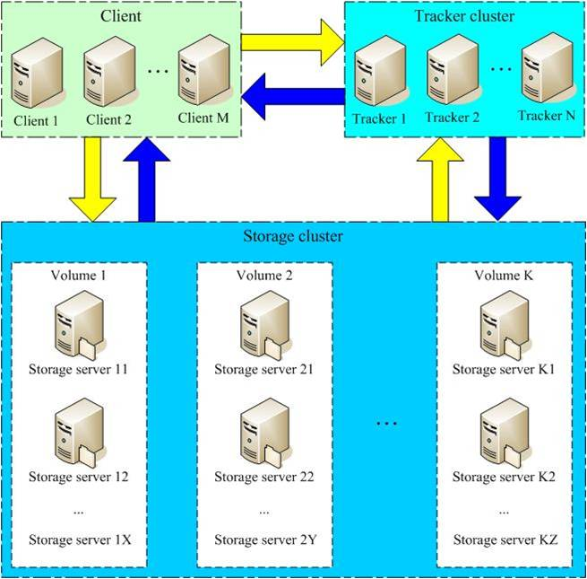
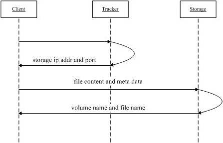
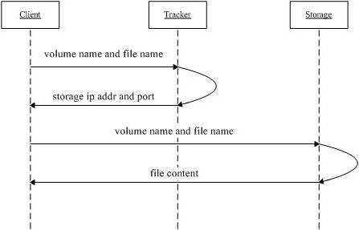

## 1、FastDFS简介
    - FastDFS 是一个轻量级的开源分布式文件系统
    - FastDFS 主要解决了大容量的文件存储和高并发访问的问题，文件存取时实现了负载均衡
    - FastDFS实现了软件方式的RAID、可以使用廉价的IDE硬盘进行存储
    - 支持存储服务器在线扩容
    - 支持相同内容的文件只保存一份、节约磁盘空间
    - FastDFS只能通过ClientAPI访问， 不支持POSIX访问方式
    - FastDFS特别适合大中型网站使用，来用存储资源文件（如： 图片、文档、音频、视频等等）

## 2、系统架构
类似有一个目录 和协调
内容


### 2.1、上传文件流程图

1. client询问tracker上传到的storage ， 不需要附加参数；
2. tracker返回一台可用的storage
3. cleint直接和storage通讯完成文件上传

### 2.2、下载文件流程图

1. client询问tracker下载文件的storage，参数为文件标识（组名和文件名）
2. tracker 返回一台可用的storage
3. client 直接和storage通讯完成文件下载
## 3、相关术语
- Tracker Server：跟踪服务器，主要做调度工作，在访问上起到负载均衡的作用。记录storage server的状态，是连接Client和Storage server的纽带
- Storage Server： 存储服务器，文件和meta data都保存到存储服务器上
- group :组，可以称为卷。 同组内服务器上的文件是完全相同的
- 文件标识：包括两部分：组名和文件名（包含路径）
- meta data: 文件相关属性、键值对（Key Value Pair）方式， 如： width=1024,height=768

## 4、同步机制
- 同一组内的storage server之间是对等的，文件上传、删除等操作可以在任意一台storage server上进行
- 文件同步只在同组内的storage server之间进行，采用push方式，即源服务器同步给目标服务器。
- 源头服务器才需要同步、备份数据不需要再次同步，否则就构成环路了
- 上述第二条规则有关例外，就是新增一台storage server时，由已有的一台storage server将已有的所有数据（包括源头数据和备份数据）同步给该新服务器。

## 5、通信协议
- 协议包由两个部分组成： header 和body
- header共有10字节、格式如下
    - 8 bytes body length
    - 1 byte command
    - 1 byte status
- body数据格式由取决于具体的命令，body可以为空

## 6、目录结构
### 6.1、tracker server
- ${base_path}
    - data
        - storage_groups.dat ： 存储分组信息
        - storage_servers.dat : 存储服务器列表
    - logs
        - trackerd.log: tracker server日志文件

### 6.2、storage server
- ${base_path}
    - data
        - data_init_flag: 当前storage server初始化信息
        - storage_stat.dat: 当前storage server统计信息
        - sync ：存储数据同步相关文件
            - binlog.index : 当前的binlog文件索引号
            - binlog.###: 存放更新操作记录（日志）
            - ${ip_addr}_${port}.mark: 存放同步的完成情况

        - 一级目录：256个存放数据文件的目录，如00， 1F
            二级目录：256个存放数据文件的目录
    - logs
        - storaged.log: storage server 日志文件

## 7、安装和运行
- step 1. download FastDFS source package and unpack it,
````
# if you use HTTP to download file, please download libevent 1.4.x and install it
tar xzf FastDFS_v1.x.tar.gz

#for example:
tar xzf FastDFS_v1.20.tar.gz
````
- step 2. enter the FastDFS dir
````
cd FastDFS
````
- step 3. if HTTP supported, modify make.sh, uncomment the line:
````
# WITH_HTTPD=1, then execude:
./make.sh

````

- step 4 make install
````
./make.sh install
````
- step 5. edit/modify the config file of tracker and storage

- step 6. run server programs
````
# start the tracker server:
/usr/local/bin/fdfs_trackerd <tracker_conf_filename>

# start the storage server
/usr/local/bin/fdfs_storaged <storage_conf_filename>
````

## 8、和其他系统对比
| 指标     | FastDFS| NFS | 集中存储设备如NetApp- NAS|
| ------------- | ------------- | ------------- | ------------- |
|线性扩容性 | 高 | 差| 差|
| 文件高并发访问性能  | 高 | 差 | 一般|
| 文件访问方式  | 专有API | POSIX| 支持POSIX|
| 硬件成本  | 较低 | 中等 | 高|
| 相同内容文件只保存一份  | 支持 | 不支持 | 不支持|

- FastDFS和mogileFS对比


## 参考网站
- [FastDFS中文](http://www.csource.org/,"")
- [FastDFS英文](http://code.google.com/p/fastdfs/,"")
---

# FastDFS分布式文件系统的安装与使用
>跟踪服务器： 192.168.230.135 (edu-dfs-tracker-01)<br/>
存储服务器：192.168.230.136 （edu-dfs-storage-01）<br/>
环境：CentOS 7.0 <br/>
用户： root <br/>
数据目录: /fastdfs （注：数据目录按照你的数据盘挂载路径而定）<br/>
安装包： <br/>
FastDFS v5.05 <br/>
libfastcommon-master.zip (是从FastDFS和FastDHT中提取出来的公共C函数库)<br>
fastdfs-nginx-module_v1.16.tar.gz : nginx模块插件 <br/>
nginx-1.6.2.tar.gz : nginx版本 <br/>
fastdfs_client-java._v1.25.tar.gz: fastdfs客户端 <br/>
源码地址： https://github.com/happyfish100/ <br/>
下载地址：http://sourceforge.net/projects/fastdfs/files/ <br/>
官方论坛：http://bbs.chinaunix.net/forum-240-1.html <br/>

## 1 所有跟踪服务器和存储服务器均执行如下操作
### 1.1、编译和安装所需的依赖包
````
# yum install make cmake gcc gcc-c++

````
### 1.2、安装libfastcommon:
#### 1.2.1、上传或下载libfastcommon-master.zip 到 /usr/local/src目录
#### 1.2.2、解压
````
# cd /usr/local/src/
# unzip libfastcommon-master.zip
# cd libfastcommon-master
````
#### 1.2.3、编译、安装
````
# ./make.sh
# ./make.sh install
libfastcommon 默认安装到了
/usr/lib64/libfastcommon.so
````

#### 1.2.4、因为FastDFS主程序设置的lib目录是/usr/local/lib, 所以需要创建软链接
````
# ln -s /usr/lib64/libfastcommon.so /usr/local/lib/libfastcommon.so
# ln -s /usr/lib64/libfastcommon.so /usr/local/libfastcommon.so
````
### 1.3、安装FastDFS
#### 1.3.1、上传或下载FastDFS源码包(FastDFS_v5.05.tar.gz) 到 /usr/local/src目录
#### 1.3.2、解压
````
# cd /usr/local/src/
# tar -zxvf FastDFS_v5.05.tar.gz
# cd FastDFS
````
#### 1.3.3、编译、安装（编译前要确保已经成功安装了libfastcommon）
````
# ./make.sh
# ./make.sh intall
采用默认安装的方式安装、安装后的相应文件与目录
A 、服务脚本在
    /etc/init.d/fasts_storaged
    /etc/init.d/fast_tracker
B、配置文件在（样例配置文件）
    /etc/fdfs/client.conf.sample
    /etc/fdfs/storage.conf.sample
    /etc/fdfs/tracker.conf.sample
C、命令工具在/usr/bin/目录下的

````
#### 1.3.4、因为FastDFS服务脚本设置的bin目录是/usr/local/bin, 但是实际上命令安装在/usr/bin,可以进入/usr/bin命令使用一下命令查看fdfs的相关命令
````
# cd /usr/bin/
# ls | grep fdfs

因此需要修改FastDFS服务脚本中相应的命令路径，也就是把/etc/init.d/fdfs_storaged和/etc/init.d/fdfs_tracker两个脚本中的
/usr/local/bin修改成/usr/bin;
# vi fdfs_trackerd
使用查询替换命令统一修改 :%s+/usr/local/bin+/usr/bin

# vi fdfs_storaged
使用查找命令替换进行统一修改  :%s+/usr/local/bin+/usr/bin
````
## 2、配置FastDFS跟踪器(192.168.230.135)
### 2.1、复制FastDFS跟踪样例配置文件，并重命名
````
# cd /etc/fdfs/

# cp tracker.conf.sample tracker.conf
````
### 2.2、编辑跟踪器配置如下
````
# vi /etc/fdfs/tracker.conf
修改的内容如下
disabled=false
port=22122
base_path=/fastdfs/tracker
````
### 2.3、创建基础数据目录(参考基础目录base_path配置)
````
# mkdir -p /fastdfs/tracker
````
### 2.4、防火墙中打开跟踪器端口(默认为22122)
````
# vi /etc/sysconfig/iptables
添加如下端口行：
-A INPUT -m state --state NEW -m tcp -p tcp --dport 22122 -j ACCEPT

重启防火墙
# service iptables restart
````
### 2.5、启动Tracker
````
# /etc/init.d/fdfs_trackerd start
（初次成功启动，会在fastdfs/tracker目录下创建data 、logs 两个目录）
查看 FastDFS Tracker是否已成功启动：
# ps -ef | grep fdfs
````
### 2.6、关闭Tracker
````
# /etc/init.d/fdfs_trackerd stop
````
### 2.7、设置FastDFS跟踪器开机启动：
````
# vi /etc/rc.d/rc.local
添加一下内容：
## FastDFS Tracker
/etc/init.d/fdfs_trackerd start

````
## 3 配置FastDFS存储（192.168.230.136）
### 3.1、复制FastDFS存储器样例配置文件，并重名：
````
# cd /etc/fdfs/

# cp storage.conf.sample storage.conf
````
### 3.2、编辑存储器样例配置文件：
````
# vi /etc/fdfs/storage.conf
修改的内容如下：
disabled=false
port=23000
base_path=/fastdfs/storage
store_path0=/fastdfs/storage
tracker_server=192.168.230.135:22122
http.server_port=8888
````
### 3.3、创建基础数据目录（参考基础目录base_path配置）
````
# mkdir -p /fastdfs/storage
````
### 3.4、防火墙中打开存储端口(默认为23000)
````
# vi /etc/sysconfig/iptables
添加如下端口信息
-A INPUT -m state --state NEW -m tcp -p tcp --dport 23000 -j ACCEPT
重启防火墙
# service iptables restart
````

## 3.5、启动Storage
````
# /etc/init.d/fdfs_storaged start
(初次成功启动，会在/fastdfs/storage目录下创建data、logs两个目录)

查看FastDFS Storage是否已成功启动
# ps -ef |grep fdfs
````
## 3.6、关闭storage
````
# /etc/init.d/fdfs_storaged stop
````
## 3.7、设置FastDFS存储开机启动
````
# vi /etc/rc.d/rc.local
添加
## FastDFS storage
/etc/init.d/fdfs_storaged start
````

# 4、文件上传测试(192.168.230.135)
## 4.1、修改Tracker 服务器中的客户端配置文件:
````
# cp /etc/fdfs/client.conf.sample /etc/fdfs/client.conf
# vi /etc/fdfs/client.conf

base_path=/fastdfs/tracker
tracker_server=192.168.230.135:22122
````
## 4.2、执行如下文件上传命令
````
# /usr/bin/fdfs_upload_file /etc/fdfs/client.conf /usr/local/src/FastDFS_v5.05.tar.gz
返回ID号：
group1/M00/00/00/werewrrwewEEsswaeaeawwwfww.tar.gz  (上传成功)
````
# 6、在每个存储节点上安装Nginx
## 6.1、fastdfs-nginx-module作用说明
> FastDFS通过Tracker服务器，将文件放在Storage服务器存储，但是同组存储服务器之间需要进入文件复制，有同步延迟的问题，假设Tracker服务器将文件
上传了192.168.4.125， 上传成功后文件ID已经返回给客户端，此时FastDFS存储集群机制将这个文件同步到同组存储19.168.4.126，在文件还没有复制完成的情况下，客户端如果用这个文件ID
在192.168.4.126上取文件，就会出现文件无法访问的错误。而FastDfs-nginx-module可以重定向连接到源服务器文件，避免客户端由于复制延迟导致的文件无法访问的错误。

## 6.2、上传fastdfs-nginx-module_v1.16.tar.gz到 /usr/local/src

## 6.3、解压
````
# cd /usr/local/src/
# tar -zxvf fastdfs-nginx-module_v1.16.tar.gz
````

## 6.4、修改fastdfs-nginx-module的config配置文件
````
# cd fastdfs-nginx-module/src
# vi config
CORE_INCS="$CORE_INCS /usr/local/include/fastdfs /usr/local/include/fastcommon/"
修改为：
CORE_INCS="$CORE_INCS /usr/include/fastdfs /usr/include/fastcommon/"
（注意：这个路径修改很重要的，不然在nginx编译的时候会报错的）
````

## 6.5、上传当前的稳定版Nginx（nginx-1.6.2.tar.gz） 到/usr/local/src目录

## 6.6、安装编译Nginx所需要的依赖包
````
# yum install gcc gcc-c++ make automake autoconf libtool pcre* zlib openssl openssl-devel
````
## 6.7、编译安装Nginx（添加fastdfs-nginx-module模块）
````
# cd /usr/local/src/
# tar -zxvf nginx-1.6.2.tar.gz
# cd nginx-1.6.2
# ./configure --add-module=/usr/local/src/fastdfs-nginx-module/src
# make && make install
````
## 6.8、复制fastdfs-nginx-module源码中的配置文件到/etc/fdfs目录，修改
````
# cp /usr/local/src/fastdfs-nginx-module/src/mod_fastdfs.conf /etc/fdfs/

# vi /etc/fdfs/mod_fastdfs.conf

tracker_server=192.168.230.135
url_have_group_name=true
store_path0=/fastdfs/storage
````
## 6.9、复制FastDFS的部分配置文件到/etc/fdfs目录
````
# cd /usr/local/src/FastDFS/conf
# cp http.conf mime.types /etc/fdfs/
````
## 6.10、在/fastdfs/storage文件存储目录下创建软链接， 将其链接到实际存储数据目录
````
# ln -s /fastdfs/storage/data/ /fastdfs/storage/data/M00
````
## 6.11、配置Nginx
````
user root;
listen  8888;

location ~/group([0-9])/M00{
    #alias /fastdfs/storage/data;
    ngx_fastdfs_module;
}

A、8888端口值是要与/etc/fdfs/storage.conf 中的http.server_port=8888相对应，因为http.server_port默认为8888，如果想改成80，则要对应修改过来。
B、Storage对应多个group的情况下，访问路径带group名，如/group1/M00/00/00/xxx,对应的Nginx配置为：
location ~/group([0-9])/M00{
    #alias /fastdfs/storage/data;
    ngx_fastdfs_module;
}
C、如查下载时如发现报404，将nginx.conf第一行 user nobody 改为 user root后重新启动
````
## 6.12、防火墙中打开Nginx的8888端口
````
# vi /etc/sysconfig/iptables
添加
-A INPUT -m state --state NEW -m tcp -p tcp --dport 8888 -j ACCEPT
# service iptables restart
````

## 6.13、启动Nginx
````
# /usr/local/nginx/sbin/nginx
(重启Nginx的命令为： /usr/local/nginx/sbin/nginx -s reload)
````
## 6.18、通过浏览器访问测试时上传的文件
http://192.168.230.136:8888/group1/M00/00/00/werewrrwewEEsswaeaeawwwfww.tar.gz


