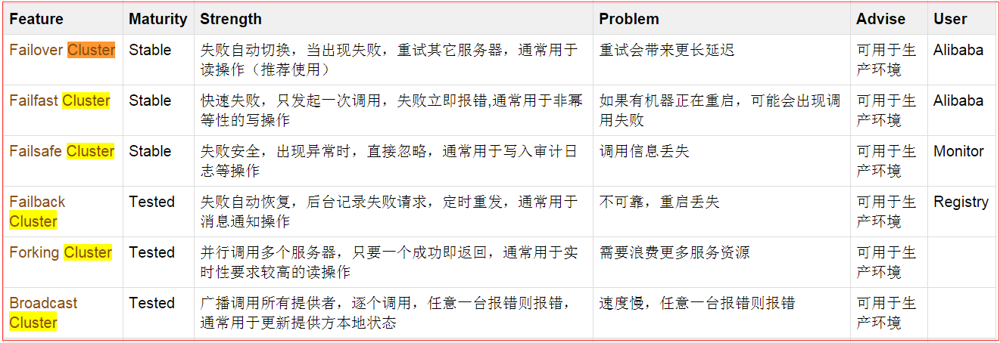

## 1、Dubbo服务集群容错配置--集群容错模式
- 标签： <dubbo:service> 、<dubbo:reference>、
<dubbo:consumer>、<dubbo:provider>
- 属性：cluster
- 类型：string
- 是否必填：可选
- 缺省值：failover
- 作用：性能调优
- 集群方式：可选： failover/failfast/failsafe/failback/forking
兼容性： 2.0.5以上版本
## 1.1、Failover Cluster
失败自动切换，当出现失败，重试其他服务器。（缺省） 通常用于读操作，但重试会带来更长延迟。可以通过retries="2" 来设置重试次数（不含第一次）

<dubbo:service retries="2"/>

或：

<dubbo:reference retries="2"/>

或：

<dubbo:reference>
    <dubbo:method name="findFoo" retries="2"/>
</dubbo:reference>

## 1.2、Failfast Cluster
快速失败，只发起一次调用，失败立即报错。通常用于非幂等性的写操作，比如新增记录
````
<dubbo:service cluster="failfast"/>
或：
<dubbo:reference cluster="failfast"/>
````

## 1.3、Failsafe Cluster
失败安全，出现异常时，直接忽略，通常用于写入审计日志等操作。
````
<dubbo:service cluster="failsafe"/>
或：
<dubbo:reference cluster="failsafe"/>
````
## 1.4、Failback Cluster
失败自动恢复，后台记录失败请求，定时重发。通常用于消息通知操作
````
<dubbo:service cluster="failback"/>

或：
<dubbo:reference cluster="failback"/>
````
## 1.5、Forking Cluster
并行调用多个服务器，只要一个成功返回。通常用于实时性要求较高的读操作，但是需要浪费更多服务资源。可通过forks="2"来设置最大并行数
````
<dubbo:service cluster="forking"/>
或：
<dubbo:reference cluster="forking"/>
````
