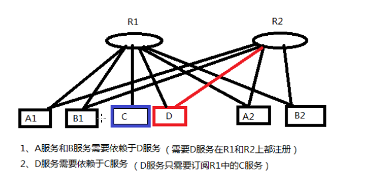

## 只注册

- 问题
> 如果有两个镜像环境，两个注册中心，有一个服务只在其中一个注册中心有部署，另一个注册中心还没有来得及部署，
而两个注册中心的其他应用都需要依赖此服务，所有需要将服务同时注册到两个注册中心，但是却不能让此服务同时依赖于
两个注册中心的其他服务。

- 解决方案
> 可以让服务提供者方， 只注册服务到另一个注册中心，而不从另一个注册中心订阅服务。

- 禁用订阅配置：
```xml
<dubbo:registry id="hzRegistry" address="10.202.153.10:9090"/>
<dubbo:registry id="qdRegistry" address="10.202.112.154:9090" subscribe="false"/>
```

或者
```xml
<dubbo:registry id="hzRegistry" address="10.202.153.10:9090"/>
<dubbo:registry id="qdRegistry" address="10.202.112.154:9090?subscribe=false"/>
```
