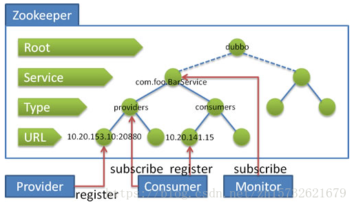

## 1、疑问
- zookeeper类似树状结构和dubbo服务注册有什么关系？

- zookeeper集群，每个zookeeper服务有一整套节点，它是如何同步的？

## 2、准备工作
- 修改操作系统的/etc/hosts文件，添加IP与主机名映射
- 下载或上传zookeeper-3.4.6.tar.gz 到某一个目录下，
- 解压zookeeper并重命名
- 在各个节点根目录下创建数据文件夹(data)和日志文件夹(logs)
- 修改配置文件复制源模板配置文件（zoo_sample.cfg） 重命名zoo.cfg
- 主要修改心跳时间、初始化连接时间、leader和follower的请求应答时间、数据目录、日志目录、客户端口（向外暴露）、以及服务集群配置组
```properties
server.1=edu-zk-01:2881:3881       #第一端口2881数据通信、第二个端口3881 选举
server.2=edu-zk-01:2882:3882
server.3=edu-zk-01:2883:3883
```
## 3、在data目录下创建myid文件（来标识某个zookeeper服务器ID）
值为1、2、3 等等

## 4、打开防火墙端口

## 5、启动并测试zookeeper
- 启动服务
- jps命令查看进程（QuorumPeerMain是zookeeper进程，说明启动正常)
- 查看服务状态，是follower还是leader

- 停止zookeeper进程：
```cmd
zkServer.sh stop
```
- 配置zookeeper开机使用wusc用户启动：（/etc/rc.local）

```cmd
su - wusc -c '/home/wusc/zookeeper/node-01/bin/zkServer.sh start'       # su - wusc 切换成wusc用户、 -c 表示执行的命令
```
## 6、安装dubbo管控台
主要注意 vi ROOT/WEB-INF/dubbo.properties配置文件设置
```properties
dubbo.registry.address=zookeeper://192.168.1.81:2181?backup=192.168.1.82:2182,192.168.1.83:2183
```

## 7、程序注册配置文件(注册服务)
```properties
dubbo.registry.address=192.168.1.81:2181,192.168.1.82:2182,192.168.1.83:2183
```