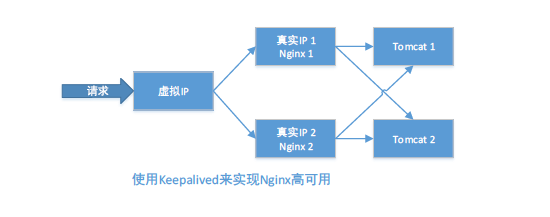

## 1、实现Nginx的高可用集群
- 阿里云： SLB
- 硬件负载均衡器（如：F5、Radware)
- 软件的负载均衡实现高可用或负载均衡 Keepalive, LVS...

## 2、Keepalived 简要介绍
Keepalived是一种高性能的服务器高可用或热备解决方案，防止单点故障，它是以VRRP协议为基础，其实就是利用多个真实ip形成一个虚拟IP
作为一个统一入口，这个虚拟IP会映射某台真实ip主机上（Master），其他主机都是（BACKUP）备用，也就是


## 3、安装Nginx
1. 安装编译Nginx所需的依赖包
```cmd
# yum install gcc gcc-c++ make automake autoconf libtool pcre pcre-devel zlib zlib-devel openssl openssl-devel

```
2. 上传Nginx到/usr/local/src)目录
3. 编译安装Nginx
```cmd
# cd /usr/local/src
# tar -zxvf nginx-1.6.2.tar.gz
# cd nginx-1.6.2
# ./configure --prefix=/usr/local/nginx
# make && make install
```
4. 配置Nginx
```cmd
# vi /usr/local/nginx/conf/nginx.conf


主要配置

user root;

listen 88;


# vi /usr/local/nginx/html/index.html
192.168.1.51中的标题 加1
<h1>Welcome to nginx! 1</h1>

192.168.1.52中的标题 加2
<h1>Welcome to nginx! 2</h1>
```
5. 系统防火墙打开对应的端口88
```cmd
# vi /etc/sysconfig/iptables
## Nginx
-A INPUT -m state --state NEW -m tcp -p tcp --dport 88 -j ACCEPT

# service iptables restart
```
6. 测试Nginx是否安装成功
```cmd
# /usr/local/nginx/sbin/nginx -t
```

7. 启动Nginx
```cmd
# /usr/local/nginx/sbin/nginx
重启 Nginx
# /usr/local/nginx/sbin/nginx -s reload
```
8. 设置Nginx开机启动
```cmd
# vi /etc/rc.local

加入：
/usr/local/nginx/sbin/nginx
```
9. 分别访问两个Nginx
## 4、安装Keepalived
1. 上传或下载keepalived 到/usr/local/src目录
2. 解压安装
```cmd
# cd /usr/local/src
# tar -zxvf keepalived-1.2.18.tar.gz
# cd keepalived-1.2.18
# ./configure --prefix=/usr/local/keepalived
# make && make install
```
3. 将 keepalived安装成Linux系统服务：
因为没有使用keepalived的默认路径安装（默认是/usr/local), 安装完成后，需要做一些工作复制默认配置文件到默认路径下
```cmd
# mkdir /etc/keepalived
# cp /usr/local/keepalived/etc/keepalived/keepalived.conf /etc/keepalived/
复制keepalived服务脚本到默认的地址
# cp /usr/local/keepalived/etc/rc.d/init.d/keepalived /etc/init.d/
# cp /usr/local/keepalived/etc/sysconfig/keepalived /etc/sysconfig/
# ln -s /usr/local/sbin/keepalived /usr/sbin/
# ln -s /usr/local/keepalived/sbin/keepalived /sbin/

设置keepalived服务开机启动
# chkconfig keepalived on 
```
4. 修改keepalived配置文件
  BACKUP（192.168.1.52）和MASTER节点配置（192.168.1.51）
```cmd
# vi /etc/keepalived/keepalived.conf  
主要虚拟端口配置、 本机ip、权重、标识本机是master还是 backup 
```
5. 编写Nginx状态检测脚本 /etc/keepalived/nginx_check.sh(已在keepalived.conf中配置)
脚本要求： 如果Nginx停止运行，尝试启动，如果无法启动则杀死本机的keepalived 进程，keepalived将虚拟ip绑定到BackUP机器上。
```cmd
# vi /etc/keepalived/nginx_check.sh

#!/bin/bash
A= ps -C nginx -no-header |wc -l`
if [$A -eq 0]; then
    /usr/local/nginx/sbin/nginx
    sleep2
    if[ps -C nginx --no-header |wc -1` -eq 0]; then
        killall keepalived
    fi
fi

保存后，给脚本赋予执行权限：
# chmod +x /etc/keepalived/nginx_check.sh
```
6. 启动Keepalived
```cmd
# service keepalived start
```
7. Keepalived+Nginx的高可用测试
- 关闭 192.168.1.51中的Keepalived会将Nginx重新启动
```cmd
# /usr/local/nginx/sbin/nginx -s stop
```
- 关闭192.168.1.51 中的Keepalived, VIP 会切换到192.168.1.52中
```cmd
# service keepalived stop
```
- 重新重启192.168.1.51中的Keepalived VIP又会切回192.168.1.51中来
```cmd
# service keepalived start
```
