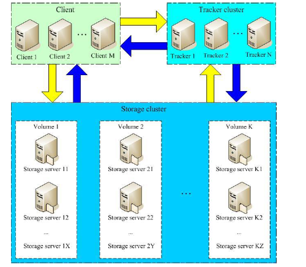
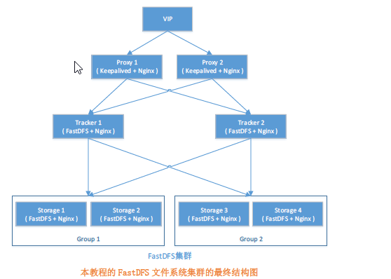

## FastDFS介绍
    FastDFS是一个开源的分布式文件系统，它对文件进行管理，功能包括：文件存储、文件同步、文件访问等待，解决了大容量存储和负载均衡的问题
FastDFS服务端有两个角色：跟踪器（Tracker）和存储节点（storage），跟踪器主要做的调度工作，在访问上起到负载均衡的作用。


最终结果图

## 1、FastDFS的安装（所有跟踪器服务器和存储服务器均执行如下操作）
1. 编译和安装所需的依赖包
```cmd
# yum install make cmake gcc gcc-c++
```
2. 安装libfastcommon
2.1 、 上传或下载libfastcommon-master.zip 到/usr/local/src目录下，解压
    
```cmd
# cd /usr/local/src/
# unzip libfastcommon-master.zip
# cd libfastcommon-master
```
2.2、编译、安装
```cmd
# ./make.sh
# ./make.sh install
libfastcommon 默认安装到了
/usr/lib64/libfastcommon.so
/usr/lib64/libfastcommon.so
```
2.3、因为FastDFS主程序设置的lib目录是/usr/local/lib,所以需要创建软链接
```cmd

# ln -s /usr/lib64/libfastcommon.so /usr/local/lib/libfastcommon.so
# ln -s /usr/lib64/libfastcommon.so /usr/lib/libfastcommon.so
# ln -s /usr/lib64/libfdfsclient.so /usr/local/lib/libfdfsclient.so
# ln -s /usr/lib64/libfdfsclient.so /usr/lib/libfdfsclient.so
```
3. 安装FastDFS
3.1 、上传或下载FastDFS源码包到/usr/local/src目录，解压
```cmd
# cd /usr/local/src/
# tar -zxvf FastDFS_v5.05.tar.gz
# cd FastDFS
```

3.2、编译、安装(编译前要确保已经成功安装了libfastcommon)
```cmd
# ./make.sh
# ./make.sh install
```
3.3、因为FastDFS服务脚本设置的bin目录是/usr/local/bin， 但实际上命令安装在/usr/bin, 可以进入/usr/bin 目录使用以下命令查看fdfs的相关
命令：
```cmd
# cd /usr/bin/
# ls | grep fdfs
```
因此需要修改FastDFS服务脚本中相应的命令路径，也就是把/etc/init.d/fdfs_storaged和/etc/init.d/fdfs_tracker两个脚本中的/usr/local/bin修改成/usr/bin
```cmd
# vi /etc/init.d/fdfs_trackerd
使用查找替换命令进行统一修改： %s+/usr/local/bin+/usr/bin
# vi /etc/init.d/fdfs_storaged
使用查询替换命令进行统一修改：%s+/usr/local/bin+/usr/bin
```