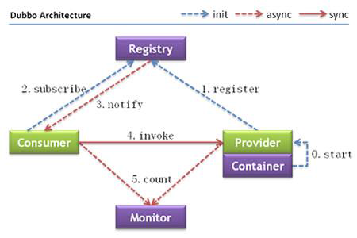

## 1、dubbo架构

### 1.1、节点角色说明：
- Provider：暴露服务的服务提供方
- Consumer: 调用远程服务的服务消费方
- Registry： 服务注册与发现的注册中心
- Monitor：统计服务的调用次数和调用时间的监控中心
- Container：服务运行容器

### 1.2、调用关系说明
0. 服务容器负责启动，加载、运行服务提供者
1. 服务提供者在启动时，向注册中心注册自己提供的服务
2. 服务消费者在启动时， 向注册中心订阅自己所需的服务
3. 注册中心返回服务提供者地址列表给消费者，如果有变更，那么注册中心将基于长连接推送变更数据给消费者
4. 服务消费者，从提供地址列表中，基于软负载均衡算法，选一台提供者进行调用，如果调用失败，在选另一台调用。
5. 服务消费者和提供者，在内存累计调用次数和调用时间，定时每分钟发送一次统计数据到监控中心。

## 2、注册中心
可选方案：zookeeper 、Redis
1. 建议使用dubbo-2.3.3以上的版本使用zookeeper注册中心客户端
2. Zookeeper是Apache Hadoop的子项目， 强度相对较好，建立生产环境使用该注册中心
3. Dubbo未对Zookeeper服务器端做任何侵入修改，只需安装原生的Zookeeper服务器即可，
所有注册中心逻辑适配都在调用Zookeeper客户端时完成。

## 3、安装zookeeper
