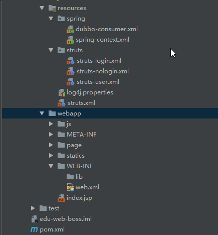

## 1、创建三个工程
- edu-facade-user: 对外服务接口工程
- edu-service-user: 具体业务实现工程（服务）
- edu-web-boss ： web工程

## 2、迁移代码
- edu-facade-user: facade接口和web工程以及服务工程需要引用的 【实体、常量、枚举类、工具类、以及异常类】


- edu-service-user: 业务实现和dao层


- edu-web-boss : 展示层和视图层需要的类


## 3、迁移资源配置文件

- edu-facade-user: 没有

- edu-service-user: 与数据库交互的mybatis、 spring相关的、jdbc、log4j、以及webapp中 web.xml(为了方便在tomcat启动应用)


- edu-web-boss : spring配置文件，前端相关框架struts， log4j、 webapp中的资源，html、js、css等等


## 4、需要新增地方
### 4.1、代码修改
- edu-facade-user ： 新增一个服务接口  PmsUserFacade
- edu-service-user： 实现改服务接口 PmsUserFacade
- edu-web-boss ： 调用 edu-facade-user的接口， （以前是直接调用biz层）
### 4.2、pom.xml
- edu-facade-user、edu-service-user、edu-web-boss 都需要引用父级maven【edu-commom-parent】（只有一个pom.xml文件）
配置常用的properties属性， 依赖版本
```xml
    <parent>
        <groupId>wusc.edu.common</groupId>
        <artifactId>edu-common-parent</artifactId>
        <version>1.0-SNAPSHOT</version>
        <relativePath>../edu-common-parent</relativePath>
    </parent>
```
- edu-service-user、edu-web-boss 都需要依赖edu-facade-user
```xml
        <dependency>
            <groupId>com.jack</groupId>
            <artifactId>edu-facade-user</artifactId>
            <version>1.0-SNAPSHOT</version>
        </dependency>
```

### 4.3、配置dubbo.xml
- edu-service-user: 服务提供者
    - 应用名称
    - 注册中心地址
    - 通信协议
    - 线程池配置
    - 服务接口的配置

```xml
<?xml version="1.0" encoding="UTF-8"?>
<beans xmlns="http://www.springframework.org/schema/beans"
       xmlns:xsi="http://www.w3.org/2001/XMLSchema-instance"
       xmlns:dubbo="http://code.alibabatech.com/schema/dubbo"
       xsi:schemaLocation="http://www.springframework.org/schema/beans
       http://www.springframework.org/schema/beans/spring-beans.xsd
       http://code.alibabatech.com/schema/dubbo
       http://code.alibabatech.com/schema/dubbo/dubbo.xsd">
       <!-- 提供方应用信息， 用于计算依赖关系-->
    <dubbo:application name="gw-service-user"/>

    <!-- 使用zookeeper注册中心暴露服务地址 -->
    <dubbo:registry protocol="zookeeper" address="192.168.3.71:2181"/>

    <!-- 用dubbo协议在20880端口暴露服务-->
    <dubbo:protocol name="dubbo" port="20880"/>

    <!-- 当ProtocolConfig和ServiceCofig某个属性没有配置时，采用此缺省值-->
    <dubbo:provider timeout="10000" threadpool="fixed" threads="100" accepts="1000"/>

    <!-- 用户服务接口-->
    <dubbo:service interface="wusc.edu.facade.service.PmsUserFacade" ref="pmsUserFacade"/>


</beans>
```

- edu-web-boss： 服务消费者
    - 应用名称
    - 注册中心服务器
    - 用户服务接口

```xml
<?xml version="1.0" encoding="UTF-8"?>
<beans xmlns="http://www.springframework.org/schema/beans"
       xmlns:xsi="http://www.w3.org/2001/XMLSchema-instance"
       xmlns:dubbo="http://code.alibabatech.com/schema/dubbo"
       xsi:schemaLocation="http://www.springframework.org/schema/beans
       http://www.springframework.org/schema/beans/spring-beans.xsd
       http://code.alibabatech.com/schema/dubbo
       http://code.alibabatech.com/schema/dubbo/dubbo.xsd">
       <!-- 消费方应用，用于计算依赖关系，不是匹配条件，不要与提供方一样-->
    <dubbo:application name="edu-web-boss"/>

    <!-- 使用zookeeper注册中心暴露服务地址 -->
    <dubbo:registry protocol="zookeeper" address="192.168.3.71:2181"/>
    <!-- 用户服务接口-->
    <dubbo:reference interface="wusc.edu.facade.service.PmsUserFacade" id="pmsUserFacade" check="false"/>
</beans>
```
### 4.4、各个配置文件中实体类和服务引用需要重新修改
