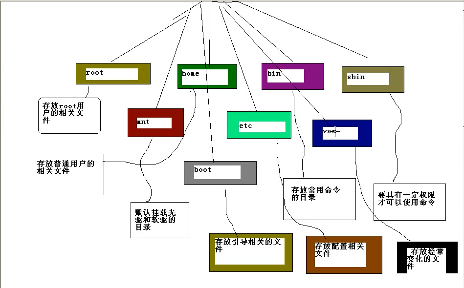

## 1、文件目录

## 2、linux的用户管理
- useradd  用户名  添加用户
- passwd 用户名  修改密码
- userdel 用户名 删除用户
- userdel -r xiaoming 删除用户以及用户主目录

## 3、常用命令2
- ls [列出文件和目录]
- ls -a 显示隐藏文件
- ls -l 显示长列表格式
- ls -al 显示隐藏文件和显示长列表格式
- mkdir 建立目录
- rmdir 删除目录

## 3、常用命令3
- touch 建立空文件
- cp 复制命令
- cp -r dir1 dir2 递归复制命令（复制子目录信息）
- mv 移动文件和改文件名
- rm 删除文件和目录
- rm -rf 删除所有内容（包括目录和文件） r 递归 f强制

ln 建立符号链接

- ln -s 源 目标
- ln -s /etc/inittab 【inittab 指向 实际文件/etc/inittab】

## 4、常用命令4
- more 显示文件内容，带分页
- less 显示文件内容带分页
- grep 在文本中查询内容
- | 管道命令

## 5、常用命令5
- find / -name a.java    [在/目录下按name查找 为a.java文件 ]

## 6、常用命令6
重定向命令
- ls -l > a.txt  列表的内容写入文件 a.txt（覆盖写）
- ls -al >> aa.txt 列表的内容追加到文件aa.txt的末尾 