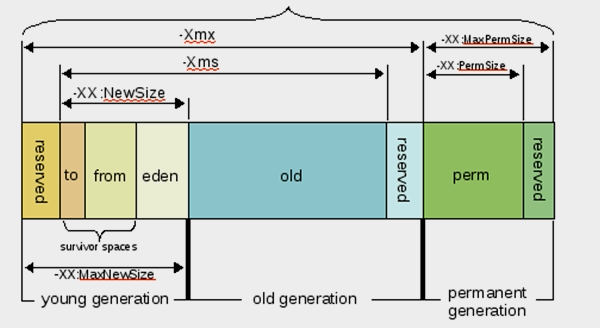

## Java 技术的组成部分
- Java程序设计语言
- Java API
- Java vm
- Java class 文件格式

## Java的编译时环境
- 源代码： .java
- a.java , b.java, c.java --> java 编译器（javac) --> a.class, b.class, c.class

## java 的运行时环境
- a.class, b.class, c.class --> JVM  <-- Object.class, String.class,(自己class)
## Java VM的组成部分： 
- java class loader(Java类加载器)： 
- java执行引擎

## Java语言特性
- 面向过程（对比）：
    - 以指令为核心
- 面向对象：
    - 以数据为核心
- 多线程： 
- 垃圾收集： GC
- 动态链接

- 动态扩展