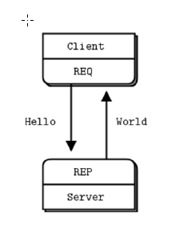
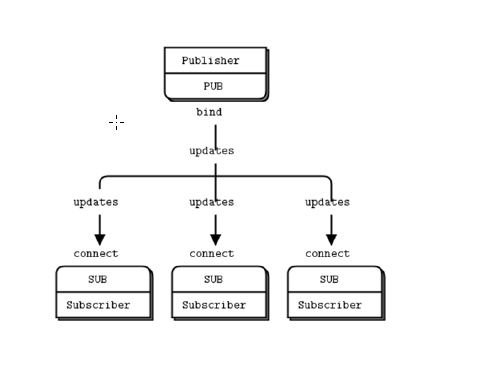
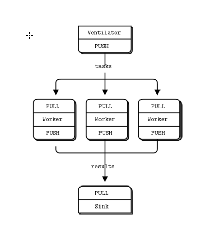

## 1、ZeroMQ
### 1.1、什么是ZeroMQ
- 可以吧ZeroMQ看成是一个轻量级，高速，但是应用更广的JMS系统或者MoM
- ZeroMQ不是一个中间件，只是一个库
- 支持进程内。进程间、TCP以及广播多种模式的通讯
- 支持点对点、订阅模式
- 支持多种语言绑定、包括C++ 、C、Java、Object-C、Scala、Erlang、Node.js、C#、Go
- ZeroMQ发送的消息模式为： 字节数+实际内容
- 同样用epoll实现
- 和Netty类似的，同样支持0拷贝

### 1.2、应答模式

### 1.3、广播订阅模式

### 1.4、分治
