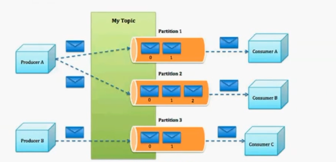

## 1、调用第三方系统
- 系统中， 如果数据来源来自串口，那么需要调用操作系统的API
- Java 中包含了COMM API， 可以直接调用串口，但是COMM API 的本质仍然是调用操作系统的API
那么如果我们的程序需要和本地API打交道，应该如何处理？
- 可以直接使用JNI 或者Swig来实现
    - JNI是Java本身提供的通过Java调用C、C++ 动态库的方法
    - Swig是支持脚本语言调用C、C++动态库的工具，支持多个语言，其中包括Java
### 1.1、JNI简单教程
- 在java类中声明native方法， 不需要实现， native表示该方法由本地动态库提供
- 编译java源文件
- 用 javah生成头文件 “javah -jni ClassName”
- 会生成头文件，自己创建.cpp文件，引用头文件，以及java提供的jni.h文件，编程成动态库
- 通过GetObejctField 获取对象上的成员
- 通过SetObjectField设置成员

### 1.2、JNI中的内存泄漏
- 由于JNI调用过程中，在native方法中，由Java栈转到本地栈，因此所有在本地栈创建的对象，如果
不转到Java栈中使用，必须要释放
    - 例如通过GetSTringUTFChars获取的char*字符串要通过ReleaseStringUTFChars释放
    - 例如通过GetXXXArrayElements获取的数组不用时应通过ReleaseXXXArrayElements
### 1.3、Java到本地接口的转换是一个很耗时的操作，没有必要不提倡这么做。


## 2、Disruptor
- Disruptor 是一个非常高效的生成消费队列
    - 通过高效的多线程处理方式， 支持纵向扩展
    - 使用内存屏障（memory barrier）实现多线程处理
    - 采用Ring buffer, 环形缓冲作为队列
- 为什么采用RingBuffer
    - 使用数组的方式而不是链表的方式进行访问，速度更快
        - 链表通过指针指向下一个元素，而数组的各个元素的地址是连续的
    - 可以为数组元素预先分配内存，避免不必要的垃圾回收（类似于对象池）
    - RingBuffer采用一个尾序号指向数组中下一个可用的元素
        当收到拒绝应答时，可以将拒绝应答的消息到尾序号之间的内容重复发送，提供更可靠的服务支持
### 2.1、如何从RingBuffer读取
- EventProcessor通过SequenceBarrier读取RingBuffer的内容
```java
import com.lmax.disruptor.EventHandler;
public class LongEventHandler implements EventHandler<LongEvent>{
    public void onEvent(LongEvent event, long sequence, boolean endOfBatch ){
        System.out.println("Event: " + event);

    }
}
```

### 2.2、不同的Wait strategy
- 对EventProcessor来说，默认的等待策略是BlockingWaitStrategy
- SleepingWaitStrategy, 循环等待，其中有一个大约60微妙的睡眠
    - 从生产者到消费者的平均处理时间有所智能车，但是对生产者线程影响较小
- YieldingWaitStrategy : 循环中有一个Thread.yeild()调用， 延迟较小
- BusySpinStrategy 延迟较小， EventProcessor数量必须小于物理CPU核的数量，不能使用超线程。

### 2.3、EventHandler处理
- 通过Disruptor.handleEventsWith(hanlder1, handler2)的方式使多个EventProcessor并行处理Event
- 通过Disruptor.handlerEventsWith(handler1).then(handler2).then(handler3)的方式，表达EventProcessor之间
的依赖关系，顺序处理。

### 2.4、如何向ringBuffer发送event
```java
public class LongEventProducer{
    private final RingBuffer<LongEvent> ringBuffer;

    public LongEventProducer(RingBuffer<LongEvent> ringBuffer){
        this.ringBuffer = ringBuffer;
    }

    public void onData(ByteBuffer bb){
        long sequence = ringBuffer.next(); //Grab the next sequence
        try{
            LongEevent event = ringBuffer.get(sequence); //Get the entry in disruptor for sequence.
            event.set(bb.getLong(0)); //Fill with data
        } finally{
            ringBuffer.publish(sequence);
        }
    }
}
```

### 2.5、Producer写入数据分为两个部分，第一个部分是从Disruptor请求下一个可用的序号，第二部分是填充数据，并告知Disruptor数据可用
- 从上述代码可以看出，Event对象的创建时RingBuffer本身完成的，因此对象空间不断被复用，即节省了创建对象的开销，也降低GC的需求
- 如何防止Producer写入的内容不覆盖
    - 自旋等待
- 如何防止多个Producer写入的内容错位？
    -CAS判断索引位置
- Producer通过ClaimStrategy获取sequence
- Disruptor解决的是scale-up【纵向扩展】 scale-out(横向扩展)的问题
    - 没有分布式，Producer/EventProcessor是运行在同一程序内的不同线程

## 3.1、Kafka是什么？
    - 一个分布式架构，可以方便的scale-out
    - 基于发布订阅的系统
    - 支持多个订阅者，失败时能够自动平衡消费者
    - 支持消息持久化

